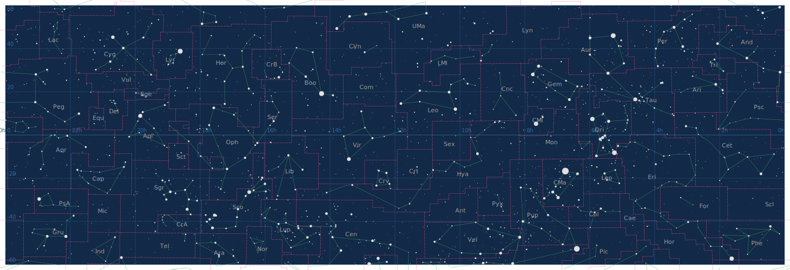

# Наборы данных о созвездиях: названия, границы, линии

## Список созвездий
Датасет `constellations.csv` содержит следующие столбцы:
| Столбец | Описание |
| --- | --- |
| `Cst_short` | Сокращённое название созвездия (три латинские буквы) |
| `Cst_lat` | Латинское название созвездия |
| `Cst_rus` | Русское название созвездия |
| `HIP_center` | Номер звезды по Hipparcos, около которой удобно расположить середину названия созвездия на карте |

Кодировка: `utf-8`, разделители - запятые.
## Границы созвездий
Существует замечательный каталог границ ["Catalogue of Constellation Boundary Data" (Davenhall A.C., Leggett S.K.)](ftp://cdsarc.u-strasbg.fr/0/cats/VI/49) 
